[LinkedIn](https://www.linkedin.com/in/swoasti-bhattacharjee) •
[Email](mailto:bhattacharjeeswoasti@gmail.com)

## About Me

I am a Computer Science Engineering student at KIIT and a Data Science student at IIT Madras.

I enjoy building software solutions, working with data, and exploring Artificial Intelligence.

### Interests

- Data Analytics
- Frontend Development
- Machine Learning
- Cloud Computing
- Open Source

## Tech Stack

### Languages

### Frontend

### Tools

## Goals

Build real-world data analytics projects

Create interactive dashboards

Contribute to open-source

Develop strong problem-solving skills

---
## GitHub Analytics

<!--  -->

  

<!--
**Swoasti07/Swoasti07** is a ✨ _special_ ✨ repository because its `README.md` (this file) appears on your GitHub profile.

Here are some ideas to get you started:

- 🔭 I’m currently working on ...
- 🌱 I’m currently learning ...
- 👯 I’m looking to collaborate on ...
- 🤔 I’m looking for help with ...
- 💬 Ask me about ...  
- 📫 How to reach me: ...
- 😄 Pronouns: ...
- ⚡ Fun fact: ...
-->
